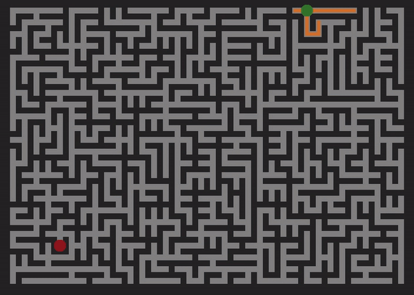
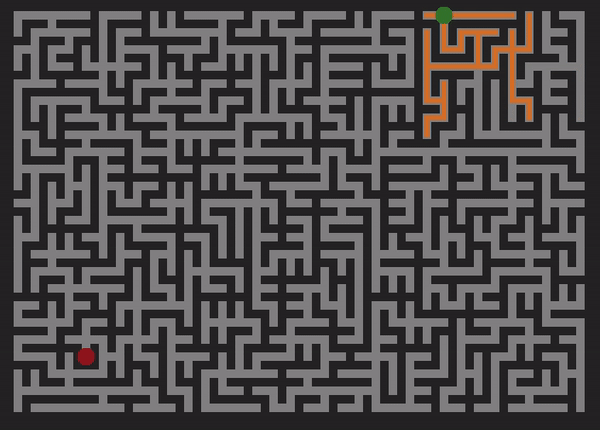

# Maze Runner

## Background
Maze Runner is a visualization tool for maze generation and path solving using JavaScript and HTML5 Canvas. It provides insight into the time and behavior of popular maze generation and traversal algorithms, such as Depth-First Search (DFS), Breadth-First Search (BFS), Dijkstra's Algorithm and A*.

## Technologies
  * Javascript - implement algorithms
  * jQuery - DOM manipulation, event handling
  * HTML5 Canvas - generate dynamic visualization
  * CSS - styling

## Prim's Algorithm

## Breadth First Search

## Depth First Search

## Dijkstra's Algorithm

## A*

## Resources
* https://bost.ocks.org/mike/algorithms/
