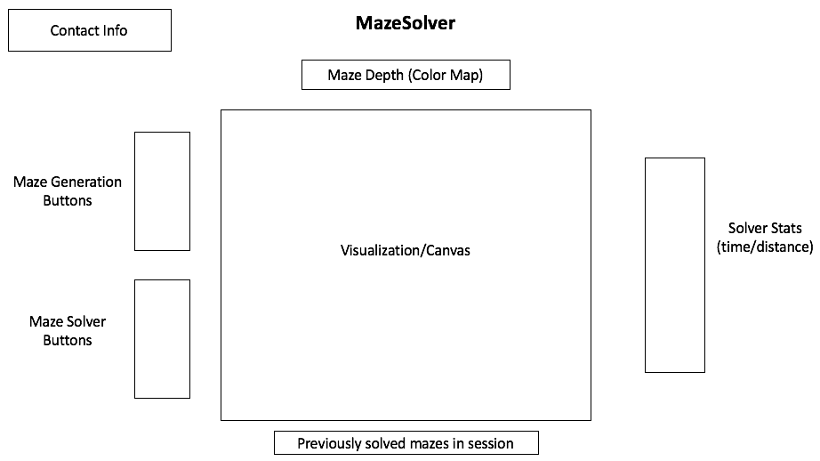

# MazeSolver

## Background
MazeSolver is a visualization tool for maze generation and path solving using JavaScript and HTML5 Canvas. It provides insight into the time and behavior of popular maze generation and traversal algorithms, such as Depth-First Search (DFS), Breadth-First Search (BFS), Dijkstra's Algorithm and A*.

## Functionality & MVP
Users will be able to switch between the different algorithms and get a recent history of previous algorithms they ran. Traversal stats will also be provided to show the user how much time it took to find the "best" path and the distance of that path. A color map will be used to indicate the depth of the tree being traversed to illuminate the characteristics of the different algorithms.

## Wireframe

## Architecture & Technologies
The algorithms will be implemented in JavaScript, while HTML5 Canvas and CSS will be used to style the tool and generate a dynamic visualization as the maze is generated or traversed.

## Implementation Timeline
* Day 1 (Wednesday) - Implement A* in JavaScript
* Day 2 (Thursday) - Refresher on HTML5 Canvas and implement initial visualization for A*, add basic layout/styling to site, get up and running on Github pages
* Day 3 (Friday) - Make sure I have good understanding of HTML5 Canvas going into weekend, implement maze generation (Prim's algorithm)
* Day 4 (Saturday) - Finish coding traversal algorithms, touch up HTML5 and layout/styling
* Day 5 (Sunday) - Documentation, documentation, documentation, and more touch up
